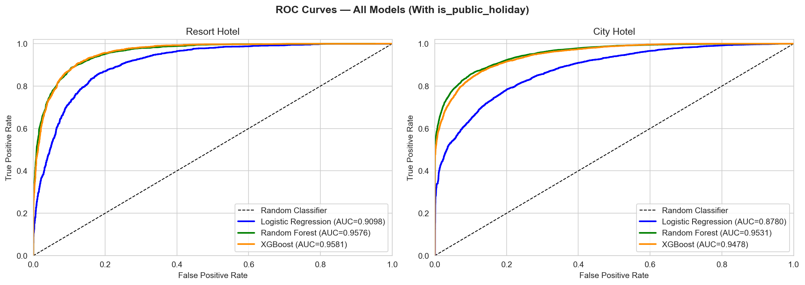
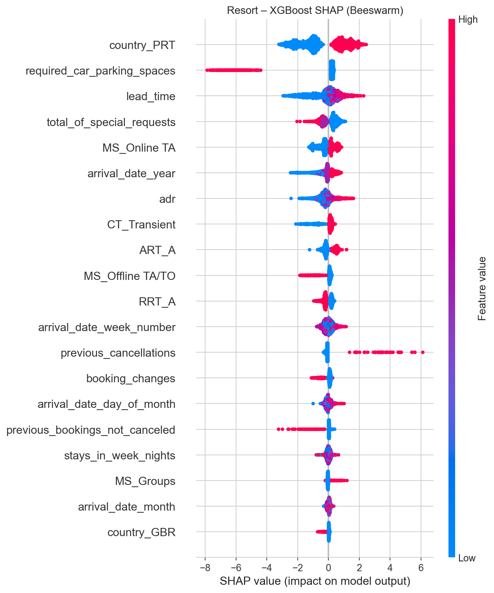
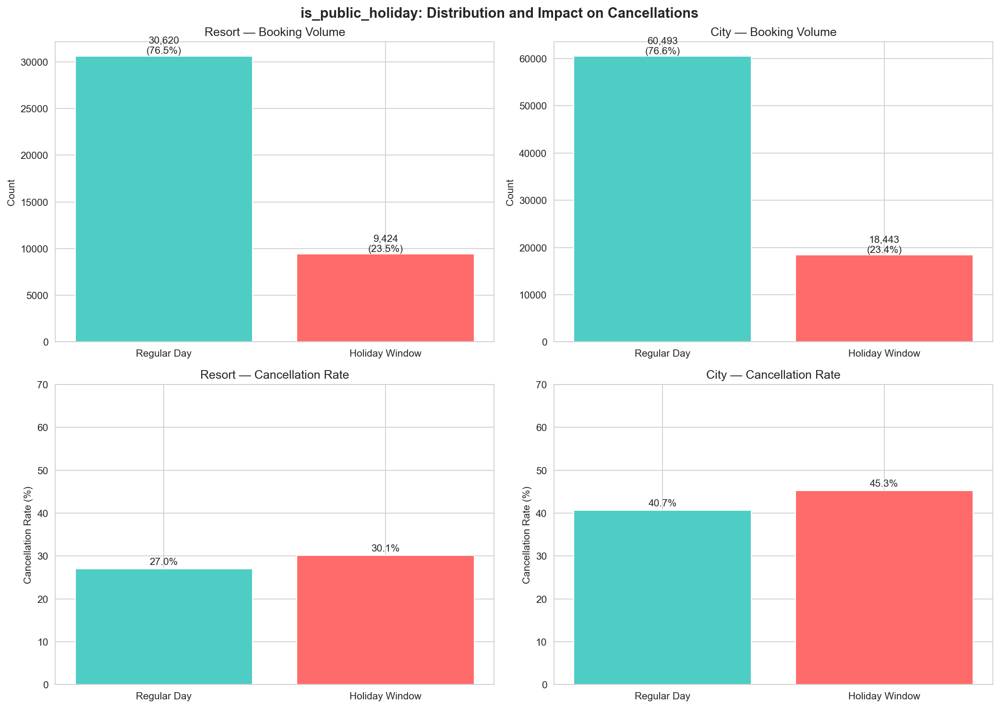

# Explainable Machine Learning for Hotel Booking Cancellations: The Role of Public Holidays

Master's thesis, Graduate School of Business IT, Kookmin University (2026).
Author: Nurbek Suvonov. Advisor: Prof. Hyunchul Ahn.

## What this is

Predicting hotel cancellations on the classic Kaggle hotel-bookings dataset is
a solved problem — plenty of papers report AUC above 0.9. This thesis asks a
question nobody had checked: **do public holidays affect whether people
cancel?** Intuitively they should. Holiday trips are planned differently,
domestic guests behave differently around national holidays, and revenue
managers treat those dates as special.

The answer, after engineering a holiday feature from 27 Portuguese national
holidays and testing it across 12 model configurations: **no, they don't.**
The holiday feature moves AUC by at most 0.0005, ranks 31st–43rd out of 64
features by SHAP importance, and its effect size on raw cancellation rates is
negligible (Cramér's V < 0.05) no matter how wide the holiday window is drawn.
A null result — but a carefully verified one, which is the point.

Along the way the thesis also delivers the positive findings: which models
work best per hotel type, what actually drives cancellations, and how badly
performance degrades when you test on future data instead of a random split.

## Results

Three models (Logistic Regression, Random Forest, XGBoost), two Portuguese
hotels (one resort, one city), 118,980 bookings (40,044 resort / 78,936 city)
from July 2015 to August 2017. Models tuned with 5-fold GridSearchCV, trained on undersampled balanced
data, evaluated on the original imbalanced test set.



| Hotel  | Best model    | AUC, random 80/20 split | AUC, temporal split (train ≤2016, test 2017) |
|--------|---------------|------------------------|-----------------------------------------------|
| Resort | XGBoost       | 0.958                  | 0.855                                          |
| City   | Random Forest | 0.953                  | 0.846                                          |

That second column matters. The ~10-point AUC drop under temporal validation
shows the random-split numbers everyone reports are optimistic: booking
behaviour drifted between 2015–16 and 2017, and a deployed model would face
that drift. Bootstrap 95% confidence intervals (1,000 iterations) confirm the
with-holiday and without-holiday models are statistically indistinguishable —
the intervals fully overlap.

## What actually drives cancellations

SHAP analysis on the best model per hotel type:



The two hotels turn out to have structurally different cancellation dynamics:

- **Guest origin dominates.** `country_PRT` (Portuguese guests) is the #1
  driver at the resort and #2 in the city — domestic guests cancel far more.
- **Car parking is a resort thing.** `required_car_parking_spaces` is the #2
  resort driver (13.3% of SHAP importance) but rank 22 in the city. A guest
  who reserved parking almost never cancels.
- **Special requests signal commitment.** The #1 city driver: guests who ask
  for things follow through on their stay.
- **Lead time is #3 everywhere** — book far ahead, cancel more often.

That divergence is itself a finding: one shared model for both hotel types
would be worse than two separate ones.

## The holiday verdict



Cancellation rates *are* a few points higher in holiday windows (30.1% vs
27.0% resort, 45.3% vs 40.7% city), and with n > 40,000 that difference is
statistically significant. But significance is cheap at this sample size:
Cramér's V stays below 0.05 across every window width from ±0 to ±7 days,
the feature adds nothing to model AUC, and SHAP ranks it near the bottom.
Statistically significant, practically irrelevant — the distinction the
thesis is built around.

## Repository contents

```
├── analysis.ipynb          the full analysis, run top to bottom
├── TECHNICAL_DETAILS.md    methods documentation: preprocessing, grids, all result tables
├── results/                output CSVs (hyperparameters, bootstrap CIs, sensitivity analysis)
├── figures/                EDA, ROC, confusion matrix, holiday analysis
├── shap_outputs/           SHAP rankings, beeswarm/bar/dependence plots
└── requirements.txt
```

## Reproducing

```bash
git clone https://github.com/nurbekkmu/hotel-cancellation-thesis.git
cd hotel-cancellation-thesis
python -m venv venv
venv\Scripts\activate        # on Linux/macOS: source venv/bin/activate
pip install -r requirements.txt
jupyter notebook analysis.ipynb
```

The notebook expects `cleaned_dataset.csv` in the repo root — the
[Kaggle hotel booking demand dataset](https://www.kaggle.com/datasets/jessemostipak/hotel-booking-demand)
(Antonio et al., 2019) after cleaning and one-hot encoding to 64 numeric
features. The encoding scheme is documented in TECHNICAL_DETAILS.md §2–3.
All random seeds are fixed at 42.

## Known limitations

1. **Two hotels, one country.** One resort and one city hotel in Portugal;
   the findings may not transfer to other markets.
2. **Temporal drift.** The 10-point AUC drop on 2017 data means these models
   would need periodic retraining in production.
3. **Possible leakage in ART_\* features.** Assigned room type is only
   finalized near check-in, so for cancelled bookings it may be a placeholder.
   `ART_A` ranks #9 (resort) / #12 (city) by SHAP. Rerunning without these
   features is left as future work.
4. **Holiday definition.** Portuguese national holidays were applied to all
   bookings, but roughly 60% of guests aren't Portuguese. A guest-origin-aware
   holiday calendar might find the signal this study didn't.

## Reference

Antonio, N., de Almeida, A., & Nunes, L. (2019). Hotel booking demand
datasets. *Data in Brief*, 22, 41–49.

```bibtex
@mastersthesis{suvonov2026,
  author = {Suvonov, Nurbek},
  title  = {Explainable Machine Learning for Hotel Booking Cancellations:
            The Role of Public Holidays},
  school = {Kookmin University},
  year   = {2026}
}
```

MIT licensed.
